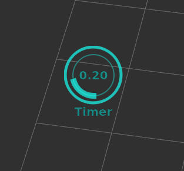

# rviz_2d_overlay_plugins

Plugin for displaying 2D overlays over the RViz2 3D scene.

Based on the [jsk_visualization](https://github.com/jsk-ros-pkg/jsk_visualization)
package, which is currently only released for ROS1, under the 3-Clause BSD license.

## Text Overlay

Both the text itself and formatting options for the text overlay are specified in
the [OverlayText.msg message type](https://github.com/teamspatzenhirn/rviz_2d_overlay_plugins/blob/main/rviz_2d_overlay_msgs/msg/OverlayText.msg)
.

### Alignment and Positioning

To allow easy positioning of the overlay along the edges of the rviz window, and to support multiple/dynamic window
sizes, the position is given by offsets from the respective border.
Depending on whether the `horizontal_alignment` is `LEFT`, `RIGHT` or  `CENTER`,
the `horizontal_distance` field sets the distance to the left or right border, or the offset from center.

For `LEFT` and `RIGHT` alignment, a distance of zero means that the text is aligned to the border without any gap,
a positive distance moves the overlay towards the center.

For `CENTER` alignment, a distance of zero means completely centered, positive values move the overlay towards the
bottom right of the window.

`TOP` and `BOTTOM` for the vertical alignment work just like `LEFT` and `RIGHT` in the horizontal case.

## Circular Gauge Overlay

The `PieChartDisplay` is a rather boring pie chart, as it only displays a single value.
`PieChartDisplay` and "Circular Gauge" are used synonymously in this package.
The gauge allows displaying a
[std_msgs/Float32](https://github.com/ros2/common_interfaces/blob/rolling/std_msgs/msg/Float32.msg).
Formatting and positioning, as well as setting the maximum value is only possible in the display options inside rviz.
